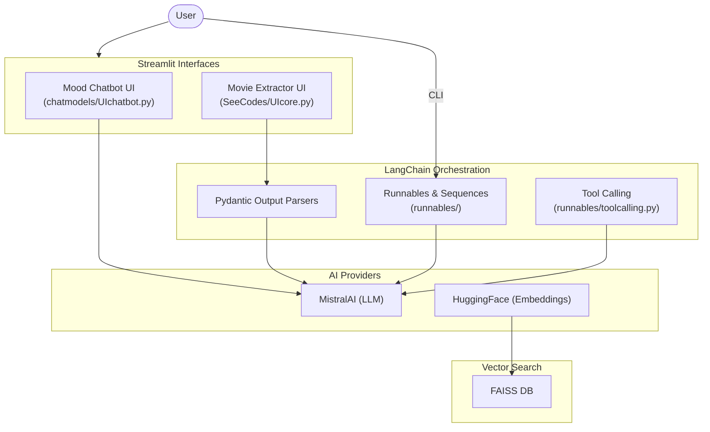

# Gen-AI Sandbox
> A collection of Generative AI experiments, chat models, and utilities using LangChain and MistralAI.

This repository serves as a sandbox for exploring and building applications with Large Language Models (LLMs). It includes implementations of various LangChain features, structured output parsers, text embeddings, and user interfaces built with Streamlit.

## Badges


## Project Overview
This project contains a variety of scripts and applications demonstrating the capabilities of modern AI frameworks. 
**Main use cases include:**
- Creating persona-based chatbots (Angry, Funny, Sad) using MistralAI models.
- Extracting structured data from raw text using Pydantic output parsers.
- Demonstrating LangChain's core concepts such as `Runnables`, sequences, and tool calling.
- Exploring embeddings and vector representations with FAISS and HuggingFace.

This repository is ideal for developers learning how to integrate LangChain with Streamlit to build interactive AI applications.

## Demo & Links
- **GitHub Repository**: [Gen-AI](https://github.com/manishkr6/Gen-AI) *(Note: Update URL if hosted elsewhere)*

## Features
**User Features (Streamlit UI)**
- 🎭 **Mood-Based Chatbot**: An interactive chatbot where users can select the AI's personality (Angry, Funny, or Sad).
- 🎬 **Movie Information Extractor**: Paste a paragraph describing a movie, and the AI extracts structured data (Title, Year, Genre, Director, Cast, Summary, Rating) and displays it as JSON.

**Backend & AI Features**
- 🤖 **MistralAI Integration**: Utilizes `mistral-small-2506` for chat generation and processing.
- 🧠 **LangChain Runnables**: Demonstrates parallel and sequential runnables, and runnable passthroughs.
- 🛠️ **Tool Calling**: Examples of providing custom tools to LLMs for advanced processing.
- 📊 **Embeddings**: Integration with HuggingFace embeddings and FAISS for vector storage.
- 📰 **News Summarizer**: A script to summarize news content.

## Tech Stack

| Technology | Purpose |
|------------|---------|
| **Python** | Primary programming language |
| **LangChain & LangGraph** | LLM orchestration and workflow management |
| **Streamlit** | Building interactive web UI for the AI agents |
| **MistralAI API** | The primary Large Language Model provider |
| **Pydantic** | Defining schemas for structured output parsing |
| **FAISS** | Vector database for similarity search |
| **HuggingFace** | Providing embedding models |
| **Dotenv** | Managing environment variables securely |

## Architecture

The project consists of multiple standalone scripts that can be categorized as follows:



## Setup & Installation

1. **Clone the repository:**
   ```bash
   git clone <repository_url>
   cd Gen-AI
   ```

2. **Install dependencies:**
   Ensure you have Python installed, then run:
   ```bash
   pip install -r requirements.txt
   ```

3. **Set up environment variables:**
   Create a `.env` file in the root directory and add your API keys:
   ```env
   MISTRAL_API_KEY=your_mistral_api_key_here
   OPENAI_API_KEY=your_openai_api_key_here
   GOOGLE_API_KEY=your_google_api_key_here
   GROQ_API_KEY=your_groq_api_key_here
   ```
   *(Note: The codebase uses MistralAI primarily, but other keys may be needed for specific scripts depending on the `requirements.txt`.)*

4. **Run the Streamlit Apps:**
   
   To run the Mood Chatbot:
   ```bash
   streamlit run chatmodels/UIchatbot.py
   ```

   To run the Movie Information Extractor:
   ```bash
   streamlit run SeeCodes/UIcore.py
   ```

   To run the CLI Chatbot:
   ```bash
   python chatmodels/chatbot.py
   ```
